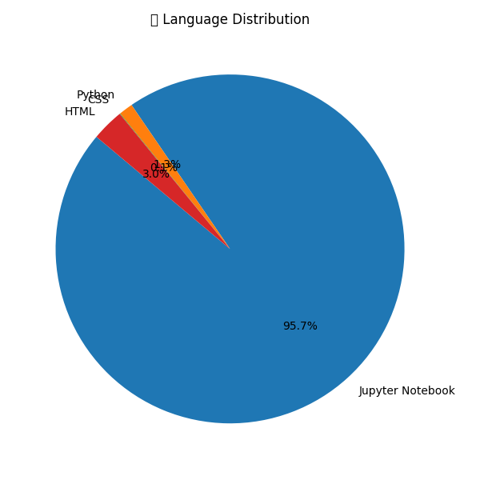
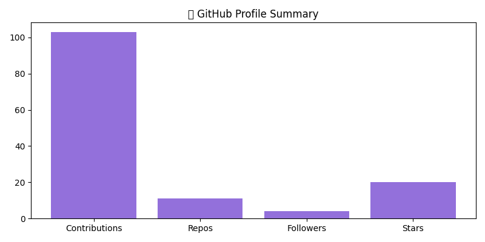

# Hi 👋, I'm Rahul Kumar Dubey

  

📅 Last Updated: {{auto_date}}

## 🧠 Auto Profile Summary (With Visuals, Tags & Projects)

### 📊 Languages Pie Chart

  

### 📈 Repo Topics Frequency

  

### 🤖 Technologies I Use
{{auto_tech_tags}}

### 🚀 Top Projects
{{auto_project_cards}}

---

### 🧰 GitHub Stats

  
  
  

---

## 📬 Engagement Overview

  

---

---

📦 This repo is a **dynamic GitHub profile template** that auto-updates visuals, tech, and projects daily. Fork it & activate your own visual AI profile 🚀
