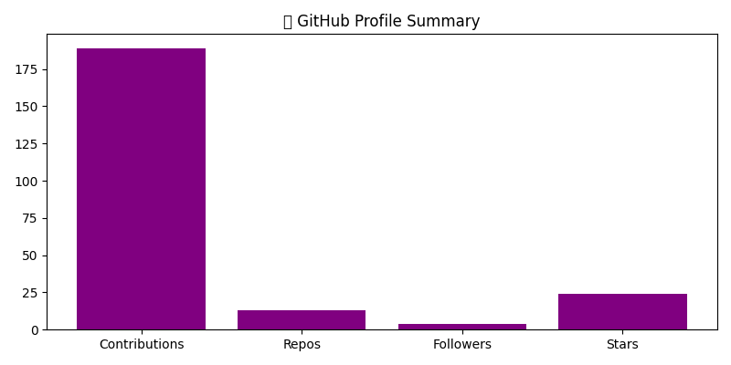
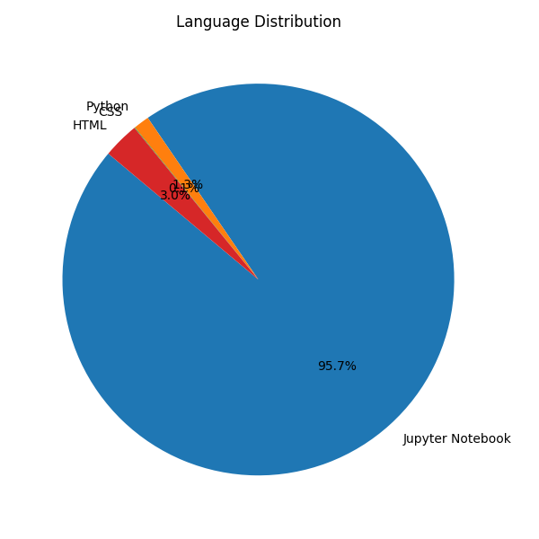
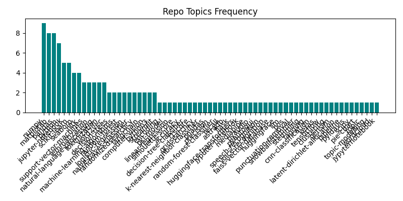

# Hi 👋, I'm Rahul  
*A Pre-Final Year Artificial Intelligence and Machine Learning Student | Data Science Enthusiast | NLP Explorer*

  

  

---

## 👨‍💻 About Me
 
### 💼 Currently:
- 🏢 **Intern** at Celebel Technologies – *Data Science*

-  I’m currently working on **NLP and Generative AI Projects**
-  I’m currently learning **Transformers, LLMs, LangChain, HuggingFace**
-  Ask me about **Machine Learning, Python, AI, and Deep Learning**

---

<!-- 🐍 GitHub Contribution Snake Animation -->

 

### 📬 Connect with Me
- 📧  [E-mail](mailto:rahuldubey9119@gmail.com)  
- 🔗 [LinkedIn](https://www.linkedin.com/in/rahul-kumar-dubey-4a4971256/)  
- 🐦 [Twitter](https://x.com/rahuldubey0129?t=j4IEIfiTFQ7eUN6-WeXCzQ&s=09)  
- 📊 [Kaggle](https://www.kaggle.com/rahul0029)
- 💻 [HackerRank](https://www.hackerrank.com/profile/rahuldubey91191)
- 📸 [Instagram](https://www.instagram.com/iamrahulzz.01/?utm_source=ig_web_button_share_sheet)
- ⚡ Fun fact: I solve real-world problems with Data & Algorithms

---

## 🚀 GitHub Analytics Summary

  

### 📊 Languages Pie Chart

  

### 📈 Repo Topics Frequency

  

---

## 🗕️ Auto-Updating Information

> ⏰ These insights update automatically  via GitHub Actions.

- Last Updated: 2025-08-14 01:58:25
- Maintained by: [RahulNeuroByte](https://github.com/RahulNeuroByte)

---

### 🤖 Technologies 

  
  
  
  
  
  
  
  
  
  
  
  
  
  
  
  
  
  
  
  
  
  
  
  
  
  
  
  
  

---

### 🚀 Top Projects

  

  

  

---

### 🧰 GitHub Stats

  
  
  
  

---

